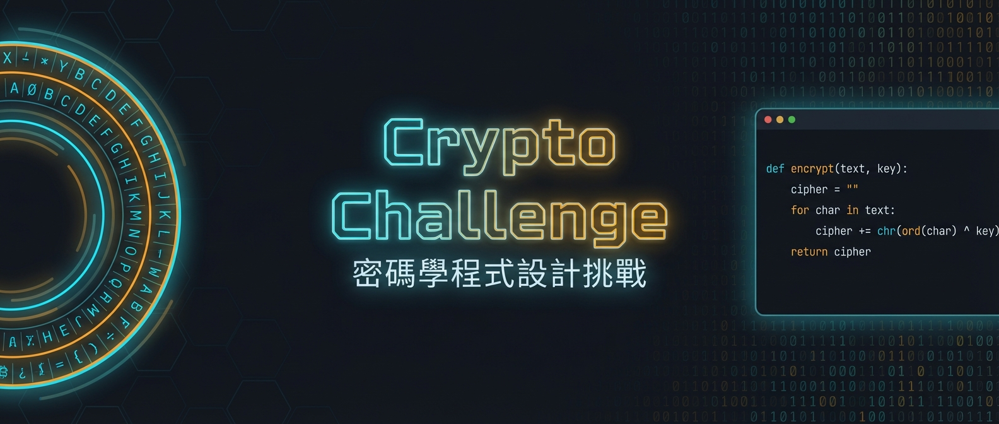

<div align="center">



# 🔐 Cryptography Challenge

**一個在瀏覽器中執行的互動式密碼學程式設計挑戰平台**

[](https://github.com/CXPhoenix/crypto-challenge)
[](./LICENSE)
[](https://vitepress.dev)
[](https://nodejs.org)
[](https://pnpm.io)
[](./.vitepress/theme/__tests__)

[快速開始](#快速開始) ❖ [題目列表](#題目列表) ❖ [部署](#部署) ❖ [貢獻指南](#貢獻指南)

</div>

---

## 簡介

Cryptography Challenge 是一個完全運行於瀏覽器端的密碼學程式設計練習平台，無需後端伺服器。使用者以 Python 撰寫解答，測試案例由 **Rust/WASM** 產生器即時生成，程式碼透過 **Pyodide**（WebAssembly Python）在 Web Worker 中執行與驗證。

```
使用者撰寫 Python → Rust/WASM 產生測試輸入 → Pyodide 執行驗證 → 即時顯示結果
```

GitHub 倉庫：<https://github.com/CXPhoenix/crypto-challenge>

## 功能特色

- **全瀏覽器執行** — 零後端依賴，Pyodide + WASM 處理所有運算
- **即時測試驗證** — 隨機產生測試案例，每次解題結果均不同
- **分割視窗 IDE** — 左側題目說明 / 右側 CodeMirror 6 編輯器（含 Python autocomplete）
- **難度分級篩選** — 簡單 / 中等 / 困難
- **frontmatter 定義題目** — 無需修改設定檔，一個 Markdown 檔即為一道題

## 題目列表

| # | 演算法 | 操作 | 難度 |
|---|--------|------|------|
| 1 | 凱薩密碼 (Caesar) | 加密 | 🟢 簡單 |
| 2 | 凱薩密碼轉換 (Caesar Advanced) | 加密 / 解密 | 🟡 中等 |
| 3 | 自製密碼表的凱薩密碼解密 | 解密 | 🟢 簡單 |
| 4 | 維吉尼亞密碼 (Vigenère) | 加密 | 🟡 中等 |
| 5 | 柵欄密碼 (Rail Fence) | 加密 | 🟡 中等 |
| 6 | 簡化 Enigma 機器 | 加密 | 🔴 困難 |
| 7 | DES ECB/CBC 模式 | 加密 | 🟡 中等 |
| 8 | RSA 基礎運算 | 加密 | 🟡 中等 |

## 技術架構

| 層次 | 技術 |
|------|------|
| 靜態站框架 | [VitePress](https://vitepress.dev) 2.x alpha |
| 前端 | [Vue 3](https://vuejs.org) + TypeScript |
| 樣式 | [Tailwind CSS 4](https://tailwindcss.com) + Typography |
| 狀態管理 | [Pinia](https://pinia.vuejs.org) |
| 程式碼編輯器 | [CodeMirror 6](https://codemirror.net) |
| Python 執行環境 | [Pyodide](https://pyodide.org) 0.29（WebAssembly） |
| 測試案例產生器 | Rust + [wasm-bindgen](https://rustwasm.github.io/wasm-bindgen/) |
| 測試框架 | [Vitest](https://vitest.dev) + Vue Test Utils |
| 套件管理 | [pnpm](https://pnpm.io) 10 |

## 快速開始

### 前置需求

- [Node.js](https://nodejs.org) 22+
- [pnpm](https://pnpm.io) 10+
- [Rust](https://rustup.rs) 工具鏈 + wasm-pack

```bash
cargo install wasm-pack
```

### 安裝

```bash
pnpm install
```

### 開發

```bash
pnpm dev
```

啟動後開啟 `http://localhost:5173`。首次執行會依序：

1. **編譯 Rust/WASM 模組**（`pnpm build:wasm`）— 將 `testcase-generator/` 編譯為 WebAssembly，輸出至 `docs/public/wasm/`
2. **下載 Pyodide 執行時期**（`pnpm build:pyodide`）— 從 jsDelivr CDN 下載 Pyodide v0.29.3 的五個核心檔案至 `docs/public/pyodide/`（已存在的檔案會自動跳過）

> [!NOTE]
> Pyodide 需要 `SharedArrayBuffer`，本地開發伺服器已自動設定 COOP / COEP 安全標頭。請使用 Chromium 系瀏覽器（Chrome / Edge）。

### 建置

```bash
pnpm build          # 建置完整靜態站（WASM + Pyodide + VitePress）
pnpm docs:preview   # 預覽建置結果
```

### 測試

```bash
pnpm test           # 執行 Vitest（140 個測試 / 19 個測試檔）
```

## 部署

### GitHub Actions Release

專案已配置 GitHub Actions workflow，當推送版本標籤（`v*`）或發佈 Release 時，自動執行：

1. 安裝 Rust 工具鏈與 wasm-pack
2. 安裝 Node.js 22 與 pnpm
3. 執行完整建置（`pnpm build`）
4. 將 `.vitepress/dist/` 打包為 `.tar.gz` 與 `.zip`，上傳至 GitHub Release assets

### 部署至靜態 Hosting

建置產物（`.vitepress/dist/`）可部署至任何靜態 hosting（Cloudflare Pages、Netlify、Vercel、GitHub Pages 等），但**必須設定以下 HTTP 安全標頭**，否則 Pyodide 將無法運作：

| Header | 值 |
|--------|-----|
| `Cross-Origin-Opener-Policy` | `same-origin` |
| `Cross-Origin-Embedder-Policy` | `require-corp` |

這兩個標頭是啟用 `SharedArrayBuffer` 的必要條件。各平台設定方式不同，請參閱對應平台的文件。

此外，專案已在 `<meta>` 中配置 Content Security Policy（CSP），包含 `wasm-unsafe-eval` 以允許 WASM 執行。

## 瀏覽器相容性

本平台依賴 `SharedArrayBuffer` 與 WebAssembly，對瀏覽器有以下要求：

| 瀏覽器 | 支援狀態 |
|--------|---------|
| Chrome 91+ | ✅ 完整支援 |
| Edge 91+ | ✅ 完整支援 |
| Firefox 79+ | ⚠️ 需伺服器正確設定 COOP/COEP 標頭 |
| Safari 15.2+ | ⚠️ 部分支援，可能有相容性問題 |

> [!IMPORTANT]
> `SharedArrayBuffer` 僅在安全上下文（HTTPS 或 `localhost`）且伺服器回傳正確的 COOP/COEP 標頭時可用。**建議使用 Chrome 或 Edge** 以獲得最佳體驗。

## 專案結構

```
cryptography-challenge/
├── .vitepress/
│   ├── config.mts               # VitePress + Vite 設定
│   └── theme/
│       ├── components/
│       │   ├── challenge/        # 題目面板、挑戰卡片
│       │   ├── editor/           # CodeMirror 編輯器、執行按鈕、結果面板
│       │   └── layout/           # SplitPane、AppHeader
│       ├── views/                # ChallengeView、ChallengeListView
│       ├── stores/               # Pinia stores（challenge、executor）
│       ├── composables/          # useWasm、useExecutor
│       ├── workers/              # Pyodide Web Worker
│       └── __tests__/            # Vitest 測試（19 個檔案）
├── docs/
│   ├── index.md                  # 首頁（ChallengeListView）
│   ├── challenge/                # 題目 Markdown（每檔即一道題，含 frontmatter）
│   ├── public/
│   │   ├── wasm/                 # Rust/WASM 建置輸出（.gitignored）
│   │   └── pyodide/              # Pyodide 執行時期檔案（.gitignored）
│   └── shared/                   # VitePress data loader
├── testcase-generator/           # Rust crate（產生隨機測試輸入）
└── scripts/
    └── download-pyodide.sh       # Pyodide 下載腳本
```

## 貢獻指南

### 新增題目

每道題目以一個 Markdown 檔案定義，位於 `docs/challenge/<slug>.md`：

```yaml
---
layout: challenge
id: <number>
title: <題目名稱>
difficulty: easy | medium | hard
tags: ["modern", "asymmetric", "math", "encrypt"]
algorithm: <snake_case_name>        # 對應 Rust 產生器邏輯
testcase_count: 8
params:
  p:
    type: int
    prime: true                     # 限定為質數
    min: 10
    max: 97
  key:
    type: hex                       # 十六進位字串
    len: 16                         # 固定長度
  plaintext:
    type: hex
    min_len: 16
    max_len: 64
    multiple_of: 16                 # 長度須為指定值的倍數
  mode:
    type: string
    values: ["ECB", "CBC"]          # 限定可選值
  m:
    type: int
    less_than: n                    # 參照其他參數的值
  keyword:
    type: alpha_upper               # 大寫英文字母
    min_len: 3
    max_len: 8
generator: |
  # Python 正確解答（用於產生預期輸出，不對使用者顯示）
starter_code: |
  # Python 起始程式碼（提供給使用者作為起點）
---
```

`params` 支援的 `type` 包括：`int`、`alpha_upper`、`alpha_lower`、`printable_ascii`、`hex`、`string`。各 type 可搭配不同的約束條件（`min`/`max`、`min_len`/`max_len`、`len`、`prime`、`multiple_of`、`values`、`less_than`）。

規格由 `testcase-generator`（Rust/WASM）解析並隨機產生輸入，再由 Pyodide 執行 `generator` 產生對應的預期輸出。

### 提交 Pull Request

1. Fork 此專案並建立功能分支：`git checkout -b feat/<feature-name>`
2. 確認測試全數通過：`pnpm test`
3. 格式化程式碼：`pnpm format`
4. 送出 Pull Request，說明改動動機與影響範圍

## 授權

本專案採用 [Educational Community License, Version 2.0 (ECL-2.0)](./LICENSE) 授權條款。
